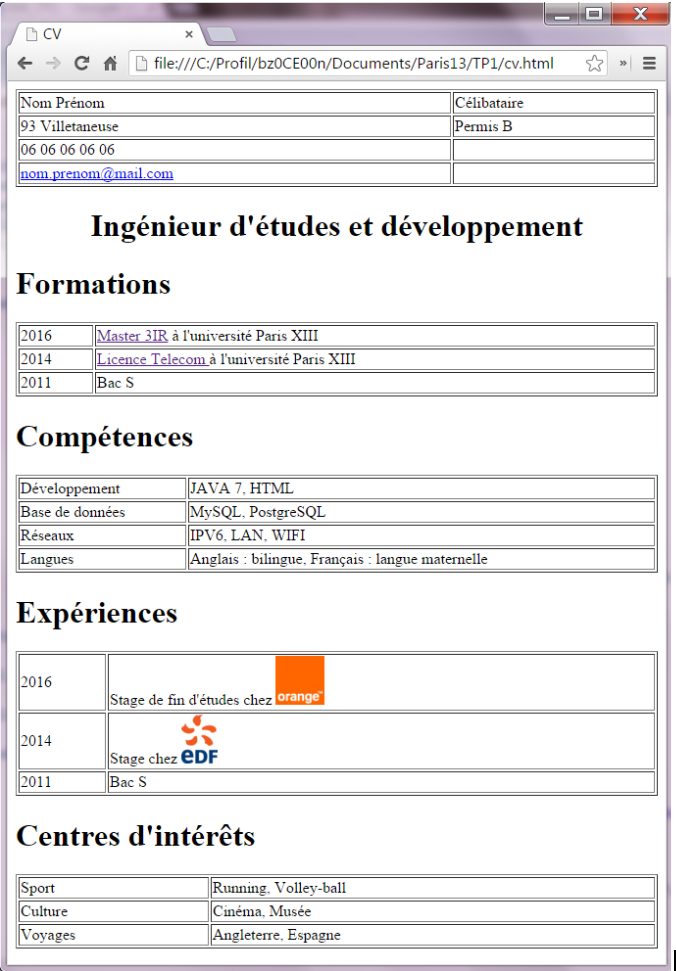
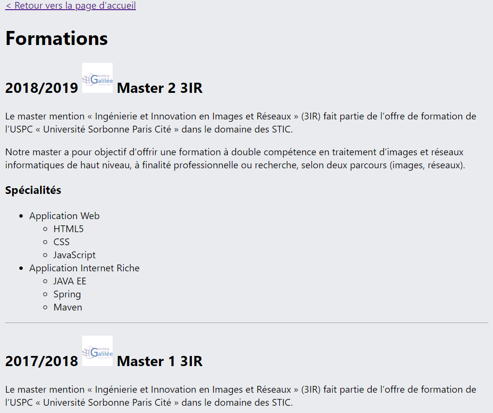

<p align="center">
  <a href="https://galilee.univ-paris13.fr/master/master-ingenierie-innovation-images-reseaux-m3ir/">
     
  </a>  
  <br/>
 Master² 3IR | <a href="https://master3ir2021.slack.com/messages/aw">master3ir20201.slack.com</a>


<p align="center">
<kbd></kbd><br/>
<h3 align="center">TP1 : CV<br/>
</p>

</h3>
Référence technique <a href="https://www.w3schools.com/">w3schools.com</>

</p>


<!-- TOC -->

- [1. Prérequis](#1-prérequis)
- [2. Plate-forme de developpement :](#2-plate-forme-de-developpement-)
- [3. HTML (index.html)](#3-html-indexhtml)
- [4. CSS](#4-css)
- [5. HTML - creation des pages formations.html et experiences.html](#5-html---creation-des-pages-formationshtml-et-experienceshtml)

<!-- /TOC -->

# 1. Prérequis

* Lire **tout** l'énoncé  avant de commencer le TP.

❓❓Si vous avez des questions ou des erreurs dans votre code : 
* formater (indenter) bien votre code (raccourci Visual Studio Code : Ctrl + K puis Ctrl + F)
* demander à Google 🔍
* demander à vos camarades 👩‍🎓👨‍🎓
* demander au professeur 🙋


# 2. Plate-forme de developpement : 

* Éditeur de texte
    * Visual studio code (recommandé) https://code.visualstudio.com/
    * Atom (installé sur les ordinateus de l'université)
    * notepad++

* Workspace
    * Votre code source devrait etre écrit dans ce répertoire tp1
    * * index.html

* Affichage de la page web
* * Ouvrir le fichier index.html avec un navigateur web (Chrome ou Firefox)


# 3. HTML (index.html)
* Écrire la structure de base d’un document HTML 

```html
<html>
    <head>...</head>
    <body> ...</body>
</html>
```

* Chaque catégorie du CV sera écrite via la balise H1

* Le détail de chaque catégorie sera écrite dans un tableau TABLE
   * pour avoir un tableau qui s’affiche sur toute la largeur de la page
    ```html
    <table width="100%" border="1">  ... </table>
    ```
* Mettre un lien vers le site internet de chacune de vos formations ou expériences professionnels.

# 4. CSS

* Créer un fichier cv.css dans le dossier "TP1"
* Entre les balises HEAD du  document index.html ajouter une référence au fichier CSS 
  
```html
<link rel="stylesheet" href="cv.css" />
```

* Écrivez vos règles CSS pour customiser le design de votre CV.
    * Exemple simple : 
        *    ```<body>``` avec un background-color gris 
        *    les tableaux ```<table>``` avec un background-color blanc
        * les liens ```<a>``` avec une couleur de texte orange au survol de la souris (:hover)
         * Colorer d'un fond de couleur différents toutes les lignes impaires des tableaux
            * Pseudo-class : ```:nth-child```
        * Au survol de la souris, changer la couleur de fond de chaque ligne du tableau
        * Au survol de la souris, agrandir les images présentés
           * 1er technique : en changeant la taille de l’image (width)
           * 2eme technique : en utilisant une transformation CSS  https://www.w3schools.com/cssref/css3_pr_transform.asp
           ```css
           transform : scale(2);
           ```
    * Utilisation des mediaquery
        * Les mediaquery permettent d’appliquer du CSS seulement quand l’écran de l’utilisateur a une certaine largeur ou hauteur.
        * Ecrire des règles qui :
            * change la couleur de fond, quand l’écran à une taille max de 300px, max 600px, max 900px et plus de 900px
            ```css
            @media only screen and (max-width: 600px) {
                body {
                    background-color: lightblue;
                }
            }
            ```
        * adapte la taille du tableau pour qu’il soit toujours visible sur toute sa largeur
# 5. HTML - creation des pages formations.html et experiences.html
* Création des pages "formations.html" et "experiences.html"
    * un *lien* "Retour vers la page d'accueil" permettra de revenir à la page index.html
    * Utiliser les balises de *titres*, de *paragraphes*, de *listes* pour détaillés votre parcours scolaire et professionel.
* Sur la page index.html, entourer les titres "Formations" et "Experiences" par des liens vers ces nouvelles pages


<center>Page "formations.html"</center>


  
<div align="center">
 --- FIN ---
 </div>
