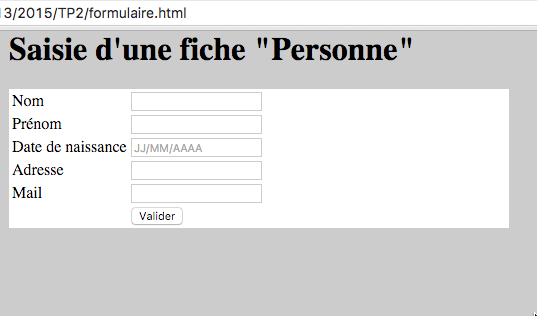
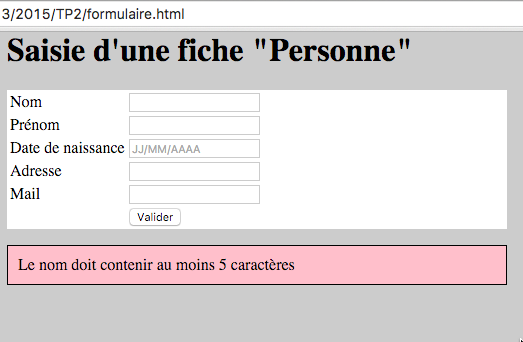
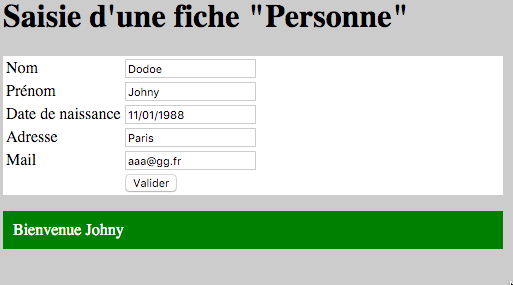

TP2

Master 3IR | [3ir2019.slack.com](https://3ir2019.slack.com)
TP AW #2 : HTML & Javascript

Validation de formulaire en JavaScript.

Support technique : http://www.w3schools.com/js/default.asp

Master 3IR | 3ir2019.slack.com
TP AW #2 : HTML & Javascript

# 1. Validation de formulaire en JavaScript.

Table des matières
=================

  * [Plate-forme de développement](#plate-forme-de-développement-)
  * [Formulaire HTML](#formulaire-html)
  * [Espace d’information pour la validation du formulaire](#espace-dinformation-pour-la-validation-du-formulaire)
  * [Validation Javascript](#validation-javascript)

Support technique : http://www.w3schools.com/js/default.asp

Le formulaire permettra de saisir les informations suivantes :
* Nom (type: text, minimum: 5 caractères, max: 20 car.)
* Prénom (type: text, minimum: 5 caractères, max: 20 car.)
* Date de naissance (type: date)
* Adresse postale (type: text, minimum: 5 caractères, max: 50 car.)
* Adresse mail (type: email, minimum: 5 caractères, max: 30 car.)

1. ## Plate-forme de développement : 
* [Visual Studio Code](https://code.visualstudio.com), Eclipse ou un Éditeur de texte (notepad++, emacs, …)
* Navigateur web (Google Chrome ou Mozilla Firefox)

2. ## Formulaire HTML
    1. Dans le votre dossier “TP2”, créer un fichier index.html
    2. Écrire le code HTML pour reproduire le formulaire suivant
        1. 
        2. vous pouvez utiliser un tableau HTML pour aligner tous les éléments
        3. Documentation sur les formulaires : [http://www.w3schools.com/html/html_form_attributes.asp](http://www.w3schools.com/html/html_form_attributes.asp)
        4. Pour la date de naissance, utilisez l’attribut  ` placeholder="JJ/MM/AAAA" ` pour indiquer à l’utilisateur le format 
        5. Code HTML pour le bouton de validation 
        ` <input type="button" value="Valider"/> `

3. ## Espace d’information pour la validation du formulaire
    1. Sous votre formulaire, écrire un endroit pour afficher les **messages d’erreur**
    ` 
 
 `
        1. cette DIV doit avoir cette mise en forme via du CSS
            * couleur de fond : rose
            * padding : 5px
            * bordure : 1px de couleur noire
            *   
            
     1. et un endroit pour écrire un **message de validation**
     ` 
 
 `
        1. cette DIV doit avoir cette mise en forme via du CSS         
            * couleur de fond : vert
            * padding : 5px
            * couleur de texte : blanc
            *  
            
4. ## Validation Javascript
    1. Créer un fichier formulaire.js
    
    2. Y faire référence dans votre code HTML (entre les balises HEAD)
    `  `
    
    3. Dans le fichier javaScript, écrire une fonction validation() qui s'exécute quand on click sur le bouton valider 
	[http://www.w3schools.com/js/js_functions.asp](http://www.w3schools.com/js/js_functions.asp)
      1. ` <input type="button" value="Valider" onclick="validation()"> `
    
    4. La fonction validation() valide que tous les champs sont remplis et contiennent **au moins 5 caractères** 
      1. pour faciliter la récupération des valeurs, ajouter un id à chaque champ de saisie
        1. exemple : ` <input type="text" name="nom" id="nom"> `
        
      2.  pour récupérer la valeur d’un champ (qui contient un id=”nom”)
        1. ` document.getElementById("nom").value ` ou ` document.querySelector("#nom").value `
        
     3. pour connaître la taille d’une chaine de caractère
       1. "ma chaine de caratère"**.length** ou ` document.getElementById("nom").value.length `

     4. Si il y un champ vide, afficher un message dans la DIV “error”
       1. ` document.getElementById("error").innerHTML = "La saisie du nom est obligatoire"; `
        
     5. Si tous les champs sont bien remplis : afficher un message dans la DIV “resultat”
       1. ` document.getElementById("resultat").innerHTML = "Bienvenue " + document.querySelector("#nom").value; `
