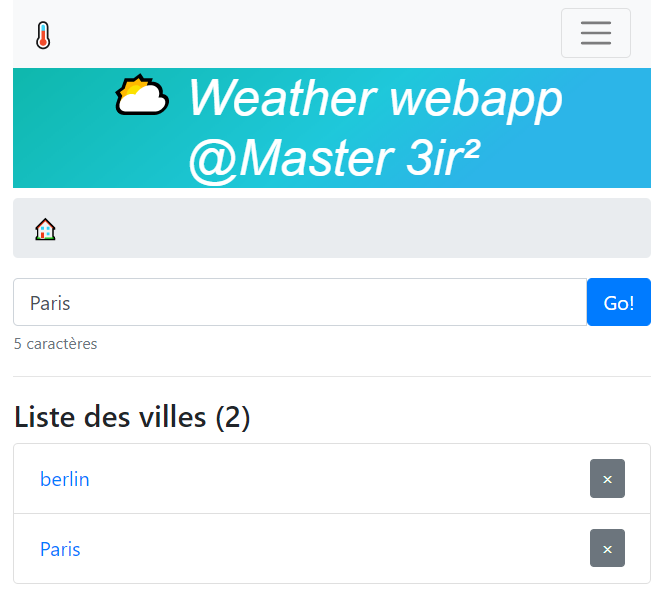
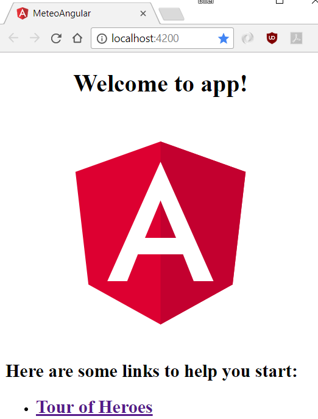
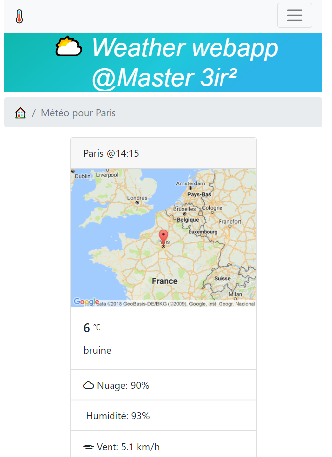

<p align="center">
  <a href="https://galilee.univ-paris13.fr/master/master-ingenierie-innovation-images-reseaux-m3ir/">
     
  </a>  
  <br/>
 Master² 3IR | <a href="https://3ir2019.slack.com/messages/aw">3ir2019.slack.com</a>


<p align="center">
<kbd></kbd><br/>
<h3 align="center">TP6 : Application Metéo (bis) ☀️<br/>
</p>

Avec [Angular](https://angular.io) et [OpenWeatherMap](http://openweathermap.org)
</h3>
</p>


⚠ Si votre connection internet est lente, demander au professeur le ZIP du projet initial. Installer [NodeJS](#1-installer-nodejs), [ng-cli](#2-installer-ng-cli) puis passer directement au point [2.3](#23-lancer-lapplication)

<!-- TOC -->

- [0. Prérequis](#0-prérequis)
- [1. Installer NodeJS](#1-installer-nodejs)
- [2. Installer ng-cli](#2-installer-ng-cli)
  - [2.1. Créer un nouveau projet avec ng-cli](#21-créer-un-nouveau-projet-avec-ng-cli)
  - [2.2. Importer Bootstrap et weather-icons avec NPM](#22-importer-bootstrap-et-weather-icons-avec-npm)
  - [2.3. Lancer l'application](#23-lancer-lapplication)
- [3. Edition de votre premier ```component``` Angular](#3-edition-de-votre-premier-component-angular)
  - [3.1 ```app.component.ts```](#31-appcomponentts)
  - [3.2. CSS du ```app.component.css```](#32-css-du-appcomponentcss)
- [4. TP : Formulaire et gestion de la liste des villes](#4-tp--formulaire-et-gestion-de-la-liste-des-villes)
  - [4.1 Créer un component pour le formulaire de recherche](#41-créer-un-component-pour-le-formulaire-de-recherche)
    - [a. Générer un component meteo](#a-générer-un-component-meteo)
    - [b. Ajouter le dans app.component.html](#b-ajouter-le-dans-appcomponenthtml)
  - [4.2. Fomulaire : ajout du module FormModule](#42-fomulaire--ajout-du-module-formmodule)
- [5. Gestion de la liste](#5-gestion-de-la-liste)
- [6. Affichage de la liste](#6-affichage-de-la-liste)
- [7. Ajout d'une page pour afficher la météo](#7-ajout-dune-page-pour-afficher-la-météo)
- [8. Ajout un emplacement dans la page principale + une navbar](#8-ajout-un-emplacement-dans-la-page-principale--une-navbar)
- [9. Créer le service MeteoService](#9-créer-le-service-meteoservice)
- [10. Créer le component MeteoDetailComponent](#10-créer-le-component-meteodetailcomponent)
  - [11. Mettre en forme les dates](#11-mettre-en-forme-les-dates)
- [12. Build : créer un package de votre application](#12-build--créer-un-package-de-votre-application)
- [13. Meteo sur 5 jours](#13-meteo-sur-5-jours)

<!-- /TOC -->

# 0. Prérequis

* Lire **tout** l'énnoncé avant de commencer le TP.

❓❓Si vous avez des questions ou des erreurs dans votre code : 
* formater (indenter) bien votre code (raccourci Visual Studio Code : Ctrl + K puis Ctrl + F)
* demander à Google 🔍
* demander à vos camarades 👩‍🎓👨‍🎓
* demander au professeur 🙋


# 1. Installer NodeJS

> Node.js nous permet d'utiliser le langage JavaScript sur le serveur... Il nous permet donc de faire du JavaScript en dehors du navigateur !

> Plus de détail : https://openclassrooms.com/courses/des-applications-ultra-rapides-avec-node-js/node-js-mais-a-quoi-ca-sert


Dans notre TP, nous utiliserons seulement le gestionnaire de dépendance [NPM](https://openclassrooms.com/courses/des-applications-ultra-rapides-avec-node-js/les-modules-node-js-et-npm#/id/r-1057300) (Node Package Manager).
Avec NPM nous allons charger toutes les librairies dont nous avons besoin : bootstrap, ...

* Installer Nodejs (version LTS - Long Time Support): https://nodejs.org/en/download/
    * Cliquer sur Windows Installer ou Macintosh Installer

* Vérifier si Nodejs est installé sur votre poste:
    * lancer un terminal (invite de commandes), puis lancer la commande
    ```cmd
    npm -v
    ```
    * Si nodejs est installé, le terminal vous affichera la version de celui-ci
    ```cmd
    npm -v
    3.10.10
    ```


# 2. Installer ng-cli

Pour créer notre projet Angular, nous utiliserons le générateur de projet Angular en ligne de commande ```ng-cli```
    * Suivre ce tutoriel officiel: https://angular.io/guide/quickstart

Executer cette ligne de commande
```cmd
npm install -g @angular/cli
```
```-g``` signifie que la commande ```ng-cli``` sera accessible depuis tous les répertoires de votre ordinateur

Vérification : entrer 
```cmd
ng -v
```

La version d'Angular CLI devrait s'afficher:
```cmd
ng -v

    _                      _                 ____ _     ___
   / \   _ __   __ _ _   _| | __ _ _ __     / ___| |   |_ _|
  / △ \ | '_ \ / _` | | | | |/ _` | '__|   | |   | |    | |
 / ___ \| | | | (_| | |_| | | (_| | |      | |___| |___ | |
/_/   \_\_| |_|\__, |\__,_|_|\__,_|_|       \____|_____|___|
               |___/

Angular CLI: 1.6.1
Node: 6.11.3
OS: win32 x64
Angular:
...
```

## 2.1. Créer un nouveau projet avec ng-cli

En ligne de commande, Positionner vous dans votre répertoire du TP6
```cmd
cd /mon-repertoire/du-tp-6/
```
Création du projet ```meteo-angular```
```cmd
ng new meteo-angular
```

Cela va vous créer donc le projet avec cette arborescence :

```
tp6/
├── meteo-angular/
│   ├── .angular-cli.json // configuration d'angular-cli pour le projet
│   ├── .editorconfig
│   ├── .gitignore      // liste des fichiers ignorés par GIT
│   ├── karma.conf.js   // Test de l'applcation
│   ├── package.json    // liste les modules à charger avec NPM
│   ├── protractor.conf.js
│   ├── README.md       // Documentation du projet (c'est ce format de fichier qui utilisé pour l'intitulé de vos TP AW)
│   ├── tsconfig.json   // configuration du compilateur TypeScript vers Javascript
│   ├── tslint.json     // configuration de l'assistant pour respecter les conventions de codage
│   │
│   └── e2e/
│   └── node_modules/
│   └── src/
│   │    └── app/                   // Le code à modifier pour votre projet
│            ├── app.component.css
│            ├── app.component.html
│            ├── app.component.spec.ts
│            ├── app.component.ts
│            └── app.module.ts
│   └── environments            // configuration du projet pour la génération des packages pour la plateforme de production et de dev 
│            ├── environment.prod.ts
│            └── environment.ts
```
<div align="center">Plus d'explications sur le rôle de chaque fichier: <a href="https://angular.io/guide/quickstart#project-file-review">angular.io/guide/quickstart#project-file-review</a>
</div>
         
Pour mieux comprendre l'architecture : https://angular.io/guide/architecture


## 2.2. Importer Bootstrap et weather-icons avec NPM

```
cd meteo-angular
npm install --save bootstrap
npm install --save weather-icons
```

```--save``` permet de référencer ces packages dans notre fichier de d'installation ```package.json```

Dans le fichier styles.css ajouter une référence vers les CSS de bootstrap et weather-icons

```css
@import "~bootstrap/dist/css/bootstrap.min.css";
@import "~weather-icons/css/weather-icons.min.css";```


<div align="center">tp6\meteo-angular\src\styles.css</div>

## 2.3. Lancer l'application

Dans le répertoire ```meteo-angular```, en ligne de commande
```cmd
ng serve --open
```

La commande ```ng serve``` va : 
* démarrer le serveur web
* examiner votre projet
* recharger l'application à chaque fois  que vous ferez des modifications dans vos fichiers

 L'option ```--open``` (ou juste ```--o```) va ouvrir automatiquement l'application dans votre navigateur à l'adresse http://localhost:4200/.

Votre app devrait afficher ce message :


<p align="center">
<kbd>
</kbd><br/>
App disponible
</p>

# 3. Edition de votre premier ```component``` Angular

## 3.1 ```app.component.ts``` 

CLI crée un premier ```component``` Angular pour vous. C'est le ```component``` racine(root) et il s'appel ```app-root```. Il se trouve ici : ```./src/app/app.component.ts```

Ouvrez le ```component``` et changer la proprité ```title``` de ```app'``` vers ```'⛅ Weather webapp @Master 3ir²'```

```ts
export class AppComponent {
  title = '⛅ Weather webapp @Master 3ir²';
}
```
<div align="center">/src/app/app.component.ts</div>


Le navigateur rechargera automatiquement la page avec le titre mis à jour.

## 3.2. CSS du ```app.component.css``` 

Ouvrez ```src/app/app.component.css``` et donnez un peu de style au titre.


```css
h1 {
  background: linear-gradient(141deg, #0fb8ad 0%, #1fc8db 51%, #2cb5e8 75%);
  color: white;
  font-family: Arial, Helvetica, sans-serif;
  font-style: italic;
  text-align: center;
  }


```
<div align="center">/src/app/app.component.css</div>


# 4. TP : Formulaire et gestion de la liste des villes

## 4.1 Créer un component pour le formulaire de recherche

### a. Générer un component meteo

Ligne de commande: 
```cmd
ng generate component meteo
```

Cette commande générera un nouveau répertoire ```src/app/meteo/``` avec:
* le code TypeScript
* le code HTML
* le fichier CSS
* le fichier pour décrire les tests unitaires

```ts
import { Component, OnInit } from '@angular/core';

@Component({
  selector: 'app-meteo',
  templateUrl: './meteo.component.html',
  styleUrls: ['./meteo.component.css']
})
export class MeteoComponent implements OnInit {

  constructor() { }

  ngOnInit() {
  }

}

```
<div align="center">meteo.component.ts (version initiale)</div>


Le component pourra etre utilisé dans l'application:
* dans le code TypeScript/Javascript en écrivant: ```MeteoComponent```
* dans le code HTML en écrivant: ```<app-meteo></app-meteo>```, nom défini par l'attribut **selector** du fichier ```meteo.component.ts``` ci-dessous

Pour que ce component soit affiché sur la page web, il faut l'ajouter à l'élément ```root``` de notre projet AppComponent.

### b. Ajouter le dans app.component.html

```html
<!-- app.component.html -->
  <h1>
    Welcome to {{ title }}!
  </h1>
  <app-meteo></app-meteo>
```


## 4.2. Fomulaire : ajout du module FormModule

Pour utiliser des formulaires avec Anguler il fait référencer le module ```FormModule```.

Dans le fichier ```src\app\app.module.ts``` ajouter le ainsi:

```ts
// debut du fichier
import { FormsModule } from '@angular/forms'; // <--  Ajouter la référence ici

import { AppComponent } from './app.component';
import { MeteoComponent } from './meteo/meteo.component';

@NgModule({
  declarations: [
    AppComponent,
    MeteoComponent
  ],
  imports: [
    BrowserModule,
    FormsModule //<-- Ajouter la référence ici aussi
  ],
  providers: [],
  bootstrap: [AppComponent]
})
export class AppModule { }
```
<div align="center">src\app\app.module.ts</div>


Créer un ficher ```meteoItem.ts```  dans le répertoire src/app/

```ts
// src\app\meteoItem.ts
export class MeteoItem {
    id: number;
    name: string;
    weather: any
}
```
<div align="center">src\app\meteoItem.ts</div>

Ajouter ce code HTML pour avoir un formulaire.
La validation de du texte saisie et les messages d'erreur du formulaire sont gérés directement dans le code HTML.
```html
<!--app\meteo\meteo.component.html-->
<nav aria-label="breadcrumb">
  <ol class="breadcrumb">
    <li class="breadcrumb-item active" aria-current="page">🏠</li>
  </ol>
</nav>

 <form (ngSubmit)="onSubmit()">
  <div class="input-group">
    <input type="search" placeholder="Ville ..." id="name" name="name" 
        class="form-control" required minlength="3"
        [(ngModel)]="city.name" #name="ngModel">

    <span class="input-group-btn">
      <button class="btn btn-primary" type="submit" [disabled]="!name.valid">Go!</button>
    </span>
  </div>
  <small *ngIf="city.name" class="text-muted">
    {{city.name.length}} caractères
  </small>

  <div *ngIf="name.invalid && (name.dirty || name.touched)" class="alert alert-danger">

    <div *ngIf="name.errors.required">
      La saisie de la ville est obligatoire
    </div>
    <div *ngIf="name.errors.minlength">
      Doit contenit au moins 3 caratères.
    </div>
  </div>
</form>
```
<div align="center">app\meteo\meteo.component.html</div>

Saisissez différentes villes pour voir les messages d'erreur s'afficher.

# 5. Gestion de la liste

Dans le fichier ```meteo.component.ts```, mettre à jour le code TypeScript :

```ts
import { Component, OnInit } from '@angular/core';
import { MeteoItem } from '../meteoItem';

@Component({
  selector: 'app-meteo',
  templateUrl: './meteo.component.html',
  styleUrls: ['./meteo.component.css']
})
export class MeteoComponent implements OnInit {

  city: MeteoItem = {
    name: '',
    id: null,
    weather: null
  };

  cityList: any;
  constructor() { }

  ngOnInit() {
    if( localStorage.cityList !== undefined){
      this.cityList = JSON.parse(localStorage.cityList);
    }else{
      this.cityList = [];
    }
   
  }

  onSubmit() {

    if (this.isCityExist(this.city.name) === false) {
      let currentCity = new MeteoItem();
      currentCity.name = this.city.name;
      this.cityList.push(currentCity);

      this.saveCityList();

      console.log(this.city.name, 'ajouté à la dans la liste');
    }else{
      console.log(this.city.name, 'existe déjà dans la liste');
    }

  }

  remove(_city) {
    // on utilise 'filter' pour retourne une liste avec tous les items ayant un nom différent de _city.name
    this.cityList = this.cityList.filter(item =>
      item.name != _city.name
    );
    this.saveCityList();
  }

  isCityExist(_cityName) {

    // la méthode 'filter' retourne une liste contenant tous les items ayant un nom égale à _cityName
    // doc. sur filter : https://developer.mozilla.org/fr/docs/Web/JavaScript/Reference/Objets_globaux/Array/filter
    if (this.cityList.filter(item =>
      item.name.toUpperCase() == _cityName.toUpperCase()
    ).length > 0) {
      return true;
    } else {
      return false;
    }
  }

  saveCityList(){
    localStorage.cityList = JSON.stringify(this.cityList);
  }

}
``` 
<div align="center">app\meteo\meteo.component.ts</div>


# 6. Affichage de la liste

Faire une boucle sur la variable ````cityList```

```html
<hr/>

<!-- Listing des villes, boucle sur l'array : cityList -->
<h4>Liste des villes ({{cityList.length}})</h4>
<ul class="list-group">
  <li *ngFor="let city of cityList"  class="list-group-item d-flex justify-content-between align-items-center">
    <a  routerLink="/meteo/{{city.name}}" class="d-block w-100">
      {{city.name}}    
    </a>
    <button (click)="remove(city)" class="btn btn-secondary btn-sm pull-right" title="Supprimer de la liste">&times;</button>
  </li>
</ul>

<div class="alert alert-primary" role="alert" *ngIf="cityList.length==0">
  Aucune ville de saisie!
</div>


<hr/>
<p>
  Utilisation du filtrer
  <strong>json</strong> pour afficher le contenu de la variable
  <strong>cityList</strong>
</p>
<pre>
{{cityList | json}}
</pre>

<!-- fin : Listing des villes -->

<hr>
```
<div align="center">app\meteo\meteo.component.html</div>


# 7. Ajout d'une page pour afficher la météo

<p align="center">
<kbd></kbd><br/>
<h3 align="center">Page détail affichant la météo️</h3><br/>
</p>

Documentation originale : https://angular.io/guide/router

Le module Angular qui gère la navigation entre les pages est ```@angular/router```

Ajouter le au fichier ```src/app/app.module.ts```
```ts
import { RouterModule, Routes } from '@angular/router';
```

La stratégie de navigation se décrit dans la variable ```appRoutes```. Cette variable devra être référencé dans les imports de @NgModule

```ts
const appRoutes: Routes = [
  { 
    path: 'meteo/:name',  // la page  affichant la météo prendra comme paramètre 'name'
    component: MeteoDetailComponent }, // Ce component fera l'appel AJAX et afficher les données reçues par openWeatherMap
  {
    path: '', // un chemin vide renverra vers '/'
    redirectTo: '/',
    pathMatch: 'full'
  },
  {
    path: '', // la page principale utilisera le component suivant
    component: MeteoComponent
  }
];

@NgModule({
  imports: [
    RouterModule.forRoot(
      appRoutes,
      { enableTracing: true } // <-- debugging purposes only
    )
    // autres imports ici
  ],
  ...
})
export class AppModule { }
```
<div align="center">src/app/app.module.ts</div>


# 8. Ajout un emplacement dans la page principale + une navbar

Dans la page ```app.component.html```, ajouter l'élément ```<router-outlet></router-outlet>``` pour que le module ```router``` change dynamiquement le contenu de la page suivant l'URL(chemin dans la barre d'adresse du navigateur).

```html
<div class="container">

  <!-- menu du haut de page -->
  <nav class="navbar navbar-expand-lg navbar-light bg-light">
    <a class="navbar-brand" routerLink="/">Météo avec Angular</a>
    <button class="navbar-toggler" type="button" data-toggle="collapse" data-target="#navbarNav" aria-controls="navbarNav" aria-expanded="false"
      aria-label="Toggle navigation">
      <span class="navbar-toggler-icon"></span>
    </button>
    <div class="collapse navbar-collapse" id="navbarNav">
      <ul class="navbar-nav">
        <li class="nav-item active">
          <a class="nav-link" routerLink="/">Accueil
            <span class="sr-only">(current)</span>
          </a>
        </li>
      </ul>
    </div>
  </nav>
  <!-- fin : menu du haut de page -->

  <!--The content below is only a placeholder and can be replaced.-->
  <div>
    <h1>
      Welcome to {{ title }}!
    </h1>
    <!-- <app-meteo></app-meteo> -->
    <router-outlet></router-outlet>
  </div>

</div>
```
<div align="center">src/app/app.component.html</div>


# 9. Créer le service MeteoService

MeteoService fera les appels AJAX vers openWeatherMap et permettra d'avoir un code plus modulaires.

Ligne de commande:
```cmd
ng g service services/meteo
```

Cette commande va créer dans le répertoire ```services``` le fichier ```meteo.service.ts```

Copier ce code et penser à mettre ```VOTRE_CLE_OPENWEATHERMAP``` à jour.

```ts
import { Injectable } from '@angular/core';
import { MeteoItem } from '../meteoItem';
import { Observable } from 'rxjs/Observable';
import { of } from 'rxjs/observable/of';

@Injectable()
export class MeteoService {

  constructor() { }


  getMeteo(name: string): Promise<any> {
    console.log('from service', name);

    let m = new MeteoItem();

    return fetch('https://demo.bilelz.fr/owmap/?q=' + name + '&units=metric&lang=fr&appid=VOTRE_CLE_OPENWEATHERMAP')
      .then(function (response) {
        return response.json();
      })
      .then(function (json) {

        // test du code retour
        // 200 = OK
        // 404 = city not found 
        if (json.cod === 200) {
          return Promise.resolve(json);
        } else {
          m.weather = json;

          console.error('Météo introuvable pour ' + name
            + ' (' + json.message + ')');

          return Promise.reject('Météo introuvable pour ' + name
          + ' (' + json.message + ')');
        }

      });

  }
}
```
<div align="center">meteo-angular\src\app\services\meteo.service.ts</div>


# 10. Créer le component MeteoDetailComponent

Commande : 

```cmd
ng generate component meteoDetail
```

Ce méthode affichera les données reçues via ```MeteoService```:

Copier ce code qui utilise la méthode meteoService.getMeteo pour valoriser la variable ```meteo```
```ts
import { Component, OnInit } from '@angular/core';
import { ActivatedRoute } from '@angular/router';
import { Location } from '@angular/common';
import {MeteoService} from '../services/meteo.service'
import { DatePipe } from '@angular/common';


@Component({
  selector: 'app-meteo-detail',
  templateUrl: './meteo-detail.component.html',
  styleUrls: ['./meteo-detail.component.css']
})
export class MeteoDetailComponent implements OnInit {

  meteo : any;

  constructor(
    private route: ActivatedRoute,
    private meteoService: MeteoService,
    private location: Location
  ) {}

  ngOnInit() {
    this.getMeteo();
  }

  getMeteo(): void {
    const name = this.route.snapshot.paramMap.get('name');
    console.log('getmeteo',name);
    this.meteoService.getMeteo(name)
      .then(meteo => this.meteo = meteo)
      .catch(fail => this.meteo = fail);
  }

}
```
<div align="center">app\meteo-detail\meteo-detail.component.ts</div>


Code HTML pour mettre en forme les données reçues :
```html
<!-- meteo de la ville selectionnée -->
<!-- meteo de la ville selectionnée -->
<div *ngIf="meteo && meteo.cod === 200">

  <nav aria-label="breadcrumb">
    <ol class="breadcrumb">
      <li class="breadcrumb-item">
        <a routerLink="/">🏠</a>
      </li>
      <li class="breadcrumb-item active" aria-current="page">Météo pour {{meteo.name}}</li>
    </ol>
  </nav>

  <div class="card" style="width:300px; margin: 0 auto" v-if="meteo">
    <div class="card-header">
      {{meteo.name}} @{{meteo.dt | date:'H:mm'}}
    </div>
    
    <div class="card-body">
      <h5 class="card-title">
        <i v-bind:class="'wi wi-owm-day-'+meteo.weather[0].id"></i>
        {{meteo.main.temp}}
        <i class="wi wi-celsius"></i>
      </h5>
      <p class="card-text">{{meteo.weather[0].description}}</p>
    </div>
    <ul class="list-group list-group-flush">
      <li class="list-group-item">
        <i class="wi wi-cloud"></i> Nuage: {{meteo.clouds.all}}%
      </li>
      <li class="list-group-item">
        <i class="wi wi-humidity"></i> Humidité: {{meteo.main.humidity}}%
      </li>
      <li class="list-group-item">
        <i class="wi wi-windy"></i> Vent: {{meteo.wind.speed}} km/h
      </li>
      <li class="list-group-item">
        <i class="wi wi-sunrise"></i> Levé du soleil: {{meteo.sys.sunrise}} // Date au format Timestamp à transformer au format 'H:mm'
      </li>
      <li class="list-group-item">
        <i class="wi wi-sunset"></i>Couché du soleil: {{meteo.sys.sunset}} // Date au format Timestamp à transformer au format 'H:mm'
      </li>
    </ul>
  </div>
</div>

<div class="alert alert-danger" *ngIf="meteo && meteo.cod !== 200">

  {{meteo.message}} (erreur {{meteo.cod}})
</div>


<hr> {{meteo | json}}
```
<div align="center">app\meteo-detail\meteo-detail.component.html</div>

## 11. Mettre en forme les dates

Pour changer le format d'affichage des dates, utiliser les filtres angular : https://angular.io/api/common/DatePipe#examples

Prendre exemple sur la première date afficher dans ```meteo-detail.component.html```

# 12. Build : créer un package de votre application

A ce stade, l'application est en état d'être utiliser.

Pour compiler et packager votre application, il suffit d'executer la commande : 

```cmd
ng build
```

Cela va créer votre projet compilé dans le répertoire ```tp6\meteo-angular\dist```. 
Ce répertoire est prêt à étre mis sur un serveur web (github pages par exemple).

💡 **C'est donc ce dossier qu'il faut mettre sur votre page Github**

```ng build``` va optimiser le code et :
* compiler le code TypeScript en Javascript
* importer que les modules NPM utilisés
* minifier le code (suppression des sauts de ligne et caractère 'espace' superflux)
* concatener tous les fichiers (component, autres TypeScript/JavaScript et CSS) dans un seul fichier


# 13. Meteo sur 5 jours

* Ajout une méthode à ```MeteoService``` qui appellera ce web service : 
https://demo.bilelz.fr/owmap/forecast/?q=popo&lang=fr&appid=0ada432b59deb9716c357092c5f79be6

* Appeler cette méthode dans le code de ```meteo-detail.component.ts```

* Etudier la structure de la réponse https://openweathermap.org/forecast5

* Modifier le code HTML pour afficher (en plus de la méteo du jour), la météo sur les 5 prochains jours

Une fois terminé, packager à nouveau votre application et envoyer la sur votre page github.


<div align="center">
 --- FIN ---
 </div>
